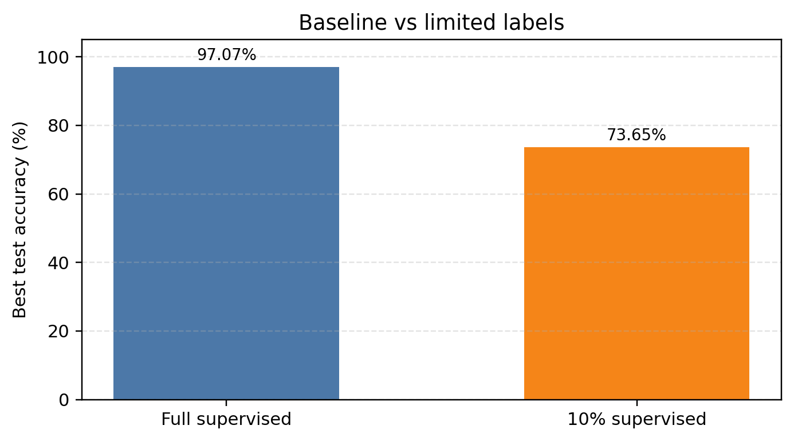
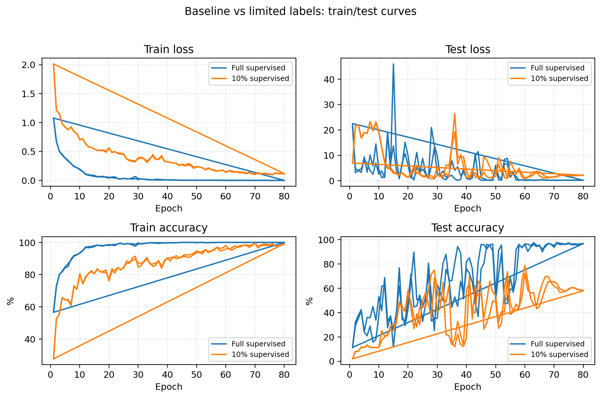
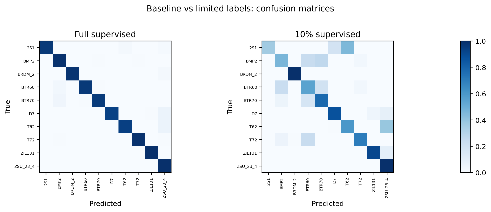
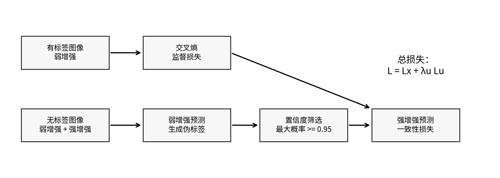
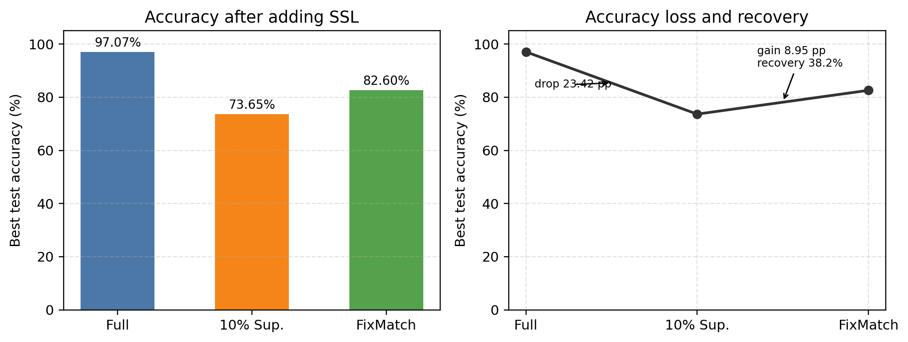
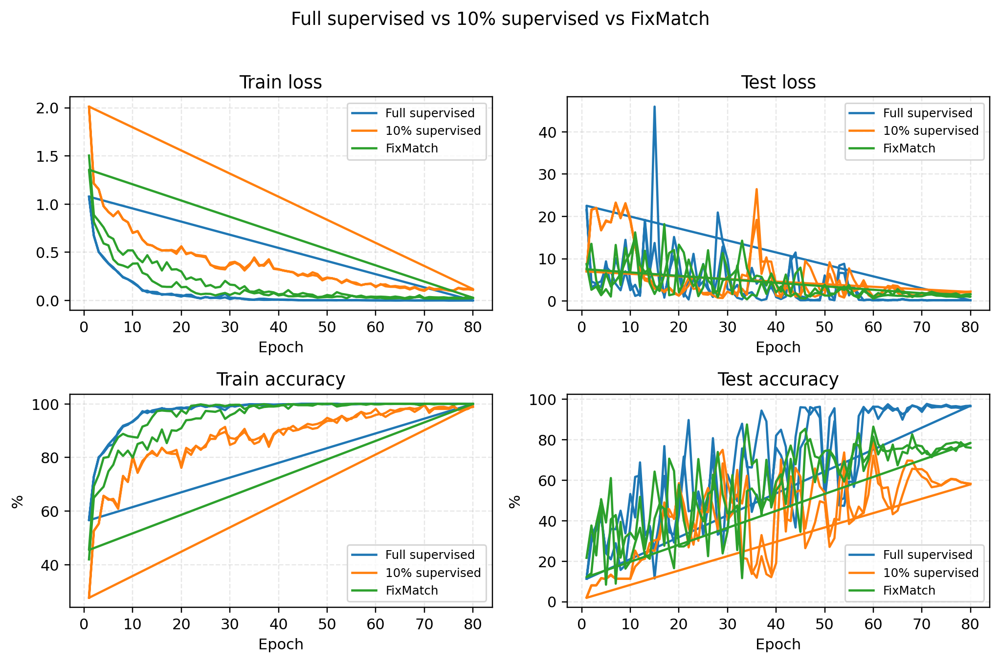
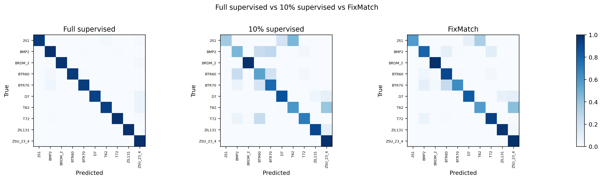

# 实践二：MSTAR 深度半监督学习实验

## 1. 基线 vs 有限标签

本实验首先训练全标签监督模型作为基线，再将训练标签减少到 10% 后训练同一网络。MSTAR 训练集共 2746 张图像，10% 标签设置下按类别分层保留 268 张有标签样本，其余 2478 张在纯监督训练中不使用。

| 实验 | 有标签样本 | 未使用无标签样本 | batch size | 学习率 | 最优测试精度 | 最优 epoch |
| --- | ---: | ---: | ---: | ---: | ---: | ---: |
| 全标签监督 | 2746 | 0 | 64 | 0.001 | 97.07% | 71 |
| 10% 标签监督 | 268 | 2478 | 64 | 0.001 | 73.65% | 54 |

结果显示，全标签监督最优测试精度为 97.07%，10% 标签监督下降到 73.65%，下降 23.42 个百分点。训练曲线和混淆矩阵说明，标签减少后模型更容易受少量标注样本限制，测试集泛化能力明显下降。

## 2. 半监督方法

本实验采用 FixMatch。其核心思想是：对无标签样本生成弱增强和强增强两个视图，先用弱增强视图得到预测概率；当最大类别概率不低于阈值 0.95 时，将该预测类别作为伪标签，再约束强增强视图输出同一类别。训练损失为 `L = Lx + lambda_u Lu`，其中 `Lx` 是有标签交叉熵损失，`Lu` 是无标签一致性损失，本实验 `lambda_u=1.0`。

## 3. 加入半监督后的结果对比

FixMatch 与 10% 标签监督使用完全相同的 268 张有标签样本，额外把剩余 2478 张训练图像作为无标签样本。FixMatch 的有标签 batch size 为 64，`μ=2`，因此每个 step 同时使用 64 张有标签图像和 128 张无标签图像。

| 实验 | 有标签样本 | 无标签/未使用样本 | batch size | μ | 学习率 | 最优测试精度 | 最优 epoch |
| --- | ---: | ---: | ---: | ---: | ---: | ---: | ---: |
| 全标签监督 | 2746 | 0 | 64 | - | 0.001 | 97.07% | 71 |
| 10% 标签监督 | 268 | 2478 | 64 | - | 0.001 | 73.65% | 54 |
| FixMatch 半监督 | 268 | 2478 | 64 | 2 | 0.001 | 82.60% | 68 |

加入 FixMatch 后，最优测试精度从 10% 标签监督的 73.65% 提升到 82.60%，提高 8.95 个百分点，恢复了约 38.20% 的精度缺口。该结果说明无标签样本能够通过伪标签和一致性约束提供额外监督信号，从而缓解有限标签导致的性能下降。
